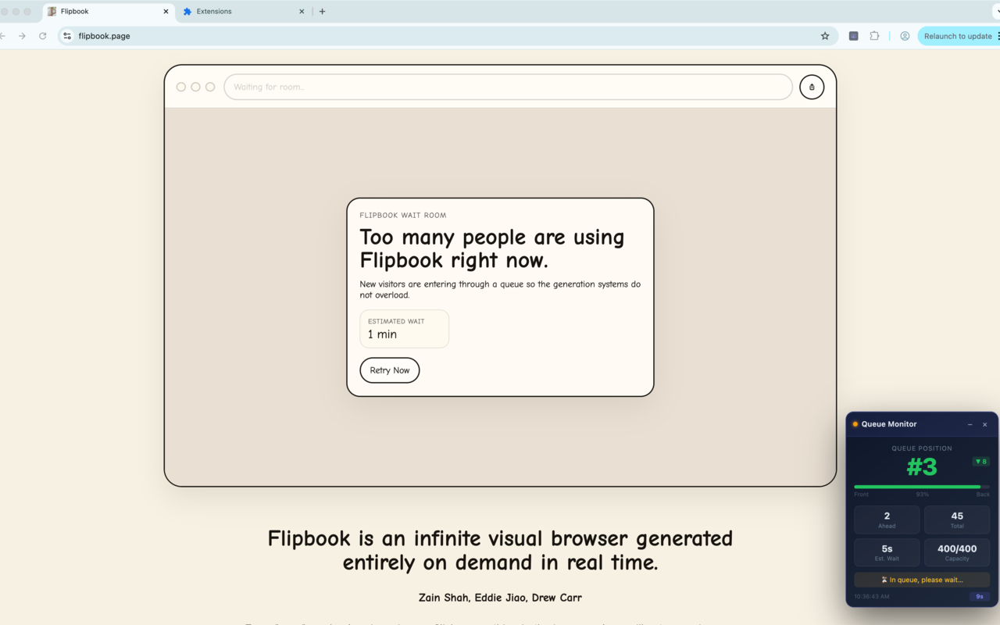
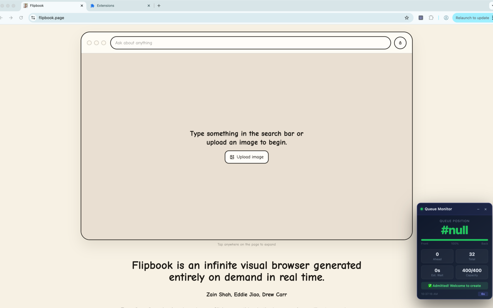

# Flipbook Waitroom Monitor

A Chrome extension that adds a real-time queue status widget to [flipbook.page](https://flipbook.page), so you can monitor your position without manually refreshing the page.

## Features

- **Live queue position** — polls the waitroom API automatically and updates every 10 seconds (or as directed by the server)
- **Progress bar** — visual indicator of how far through the queue you've moved
- **Stats panel** — shows people ahead, total queue length, estimated wait time, and current admission capacity
- **Position change indicator** — highlights movement up or down since the last update
- **Admitted alert** — plays a sound, flashes the widget green, and sends a browser notification when you're let in
- **Draggable & minimizable** — move the widget anywhere on screen; collapse it to a compact pill when not needed

## Screenshots

| Waiting in queue | Admitted |
|:---:|:---:|
|  |  |

## Installation

1. Clone or download this repository.
2. Open Chrome and navigate to `chrome://extensions`.
3. Enable **Developer mode** (top-right toggle).
4. Click **Load unpacked** and select the project folder.
5. Navigate to [flipbook.page](https://flipbook.page) — the widget appears automatically in the bottom-right corner.

## Files

| File | Description |
|------|-------------|
| `manifest.json` | Extension manifest (Manifest V3) |
| `content.js` | Widget logic — DOM creation, polling, rendering, notifications |
| `styles.css` | Widget styles |

## Permissions

| Permission | Reason |
|------------|--------|
| `notifications` | Show a browser notification when you are admitted to the room |
| `host_permissions: https://flipbook.page/*` | Inject the content script and fetch the waitroom API |

## How It Works

The extension injects `content.js` into every `flipbook.page` tab. On load, it:

1. Creates a floating widget and appends it to the page.
2. Calls `GET https://flipbook.page/api/waitroom` (with session cookies) to retrieve queue data.
3. Renders position, progress, and stats, then schedules the next poll using the `poll_after_ms` value returned by the API (default 10 s).
4. When `admitted` is `true` in the response, it fires a sound + browser notification and stops the admitted-alert from repeating.
